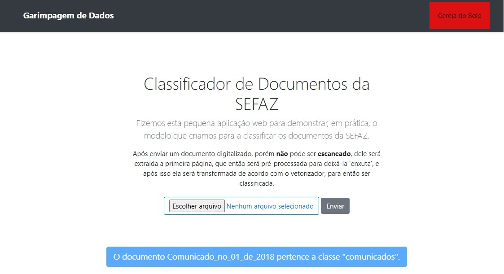

# Trabalho_Final-Mineracao-SEFAZ

   ## Trabalho final da cadeira CK0223 - MINERAÇÃO DE DADOS da UFC, com tema de Classificação de Arquivos Legislativos da SEFAZ.
   
   ## Equipe:
- ALEXEI ALVES DE SOUZA  - 398611
- GUSTAVO BEZERRA FECHINE  - 397269
- NATANAEL MOREIRA DE LEMOS - 398447
- RAMIRO CAMPOS DE CASTRO - 400723
   
   <!-- ## -->
    #### Na pasta DownloadArquivos, encontra-se um notebook para obter os links a partir do site da SEFAZ, e um outro notebook para realizar os downloads dos mesmos e os colocar em pastas equivalentes ao do site da SEFAZ.
   
   ###
   #### O arquivo ArquivosPrimeiraPagina.csv possui as primeiras páginas de todos os arquivos, sem nenhum pré-processamento, já o arquivo ArquivosProcessados.csv possui os arquivos pós-processamento.

   #### O notebook TrabalhoFinalGarimpagem é o que usamos no colab para analisar os dados e realizar o treinamento dos modelos.

   #### Após selecionar um modelo, criamos uma pipeline com as etapas utilizadas pelo modelo para classificar um documento já pré-processado. Então colocamos está pipeline num aplicação Flask, criada para demonstrar o resultada do uma predição.

   

      
   

